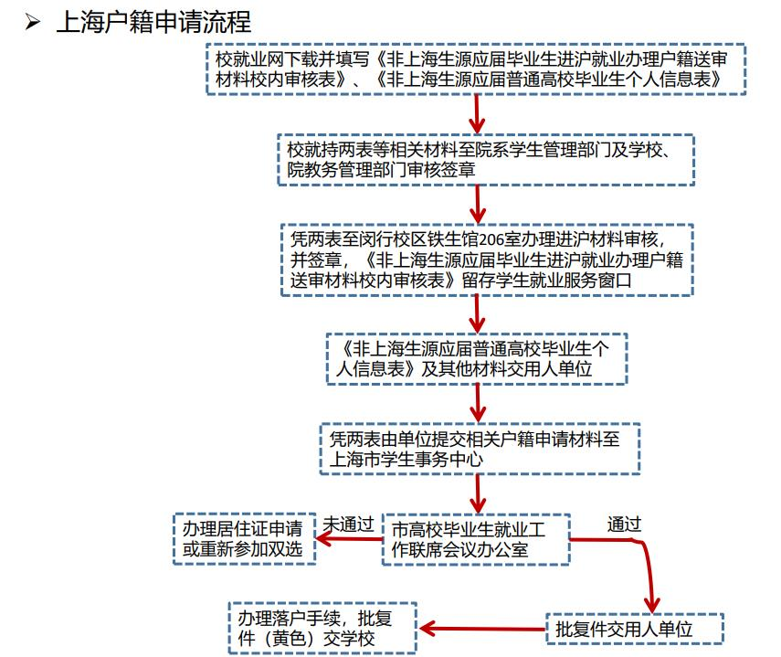

# 2020年非上海生源应届普通高校毕业生落户材料办理流程及注意事项

备注1：此文件主要是以上海交通大学返校办理落户材料流程及注意事项为例，其他高校亦可参考，办理流程大同小异。

备注2：若申请材料中包含“获专利证书”、“荣誉称号证书”和“重大奖励证书”，请向相关工作人员咨询具体流程。

## 一、申请返校
1.请至少提前1日（14点前）提出进校申请。  
2.请告知进校时间段。几日，几点到几点（24小时制）。  
3.请告知用于接收短信的手机号。  
⭐ 进校前需将签署好（手写签名）的承诺事项列表电子版发送于学院负责老师。  
⭐ 请于进校三日内完成离校手续，并离开校园。  
⭐ 此申请为临时进校，不能重复多次申请。  

##二、办理落户材料（盖章证明）
### 落户具体流程
1、落户申请  
2、落户申请通过，获得批复并办理报到证打印  
3、报到证上交公司，获得证明信  
4、拿证明信去居住地所在派出所办理准迁证  
5、拿到准迁证，去原户籍地派出所办理迁移证  
6、获得迁移证回到居住地派出所办理上海户口（个人户口卡）  
7、拿到户口后，去街道办办理劳动手册（就业创业证）  

### [2020应届生落户相关材料清单](./2020应届生落户相关材料清单.doc)
|序号  |材料名称  |要求  |盖章  |
|:---:|:------:|:----:|:---:|
| 1	|《2020年非上海生源应届普通高校毕业生个人信息表》|打印（正反面）并按顺序填写 负责人签字|学校教务部门（或校研究生培养单位）和就业办盖章|
| 2	|毕业生推荐表|原件|学校（或研究生培养单位）就业部门盖章|
| 3	|就业协议书|自己的那份原件|就业部门盖章|
| 4	|成绩单|按学期分列|学校（或研究生培养单位）教务部盖章|
| 5	|外语等级证书|复印件|学校（或研究生培养单位）教务部门或就业部门盖章|

### 返校办理落户必带材料：
六级证书原件  
六级证书复印件一份  
成绩单原件  
[《2020年非上海生源应届普通高校毕业生个人信息表》（蓝表）](./2020年非上海生源应届普通高校毕业生个人信息表.doc)
[《非上海生源应届毕业生进沪就业办理户籍送审材料校内审核表》（白表）](./非上海生源应届毕业生进沪就业办理户籍送审材料校内审核表.doc)

### 盖章流程：
1、拿着《非上海生源应届毕业生进沪就业办理户籍送审材料校内审核表》（白表）、《2020年非上海生源应届普通高校毕业生个人信息表》（蓝表）、《成绩单》和其它提交材料（含等级证书）（需验原件）到院系审核并在复印件上盖章，院系审核被审核人提交的有关材料后审核人应签名，“院系总审意见”请院就业工作负责人签名、盖章。  
⭐ 学院老师应当：在白表的右侧栏签字、在蓝表学习成绩评定处评定成绩并签字和盖章、在六级证书复印件上盖章、在白表左下栏签字并盖学生办的章  

2、教务处或研究生院培养办公室（陈瑞球楼328）对已由院系盖章的《成绩单》和《进沪学习成绩评定表》进行审核，并在《白表》里的“成绩单审核意见”栏内、《成绩单》以及《进沪学习成绩评定》上分别盖章。  
⭐ 研究生院老师应当：在白表右下角盖章、在蓝表学习成绩评定处盖章、在成绩单原件上盖章  

3、已由院系盖章的《白表》、《蓝表》、《成绩单》、《进沪学习成绩评定》和其它提交材料（含等级证书）送校就业中心（铁生馆二楼的就业办206室）盖章。《白表》由校就业中心留存。  
⭐ 你应当：递交白表给就业办  
⭐ 就业办老师应当：在蓝表最后一栏学校推荐意见处签好信息并盖章  

⭐最后收获：盖有三个章的蓝表、盖章的成绩单原件、盖章的六级复印件。  

在校内办理相关材料审核过程中，还需要注意以下事项：  
1、提交表格**无涂**改现象。  
2、提交申请材料中的外语等级证书，到校就业中心审核前，必须先由所在学院就业工作负责人签字和盖学院公章。  
3、通过后，批复件交用人单位办理落户手续，批复件（黄色）交学校  
如有疑问可以咨询就业中心或上海市学生事务中心（62829191）  

### 落户需要提交的材料：（全部扫描成pdf发送邮件给HR审核）  
1、英语六级复印件（学校盖章）  
2、成绩单原件（学校盖章）  
3、个人信息表原件（学校盖章）  
4、就业推荐表原件（学校盖章）  
5、就业协议书（自己那份原件，学校盖章）  
6、本科学位证复印件  
7、本科毕业证复印件  
8、硕士学位证复印件  
9、硕士毕业证复印件  

备注3：对落户审核结果有异议的，用人单位可在就业创业服务网公布结果后30天内向上海市学生事务中心提出书面申诉。

备注4：详细通知及其他注意事项请浏览[《关于做好2020年非上海生源应届普通高校毕业生进沪就业工作的通知》](./关于做好2020年非上海生源应届普通高校毕业生进沪就业工作的通知.pdf)

最后，祝大家顺利落户，前程似锦！